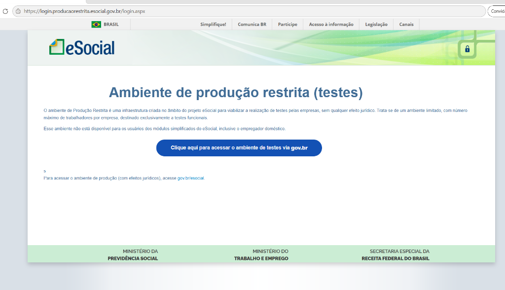
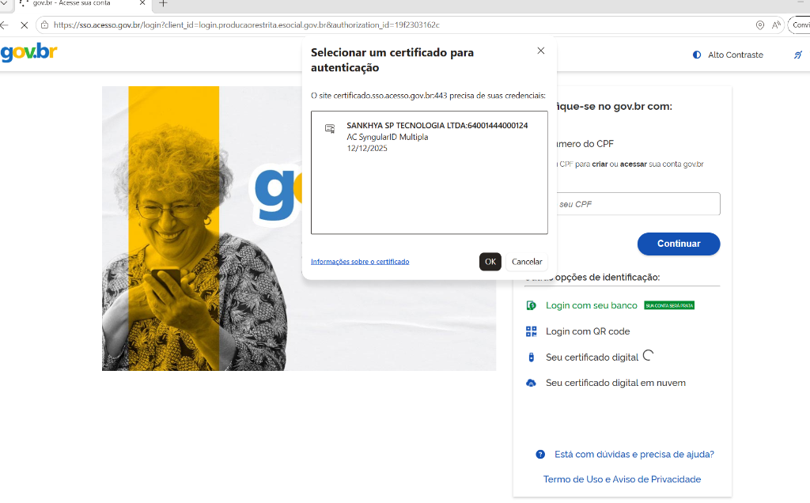
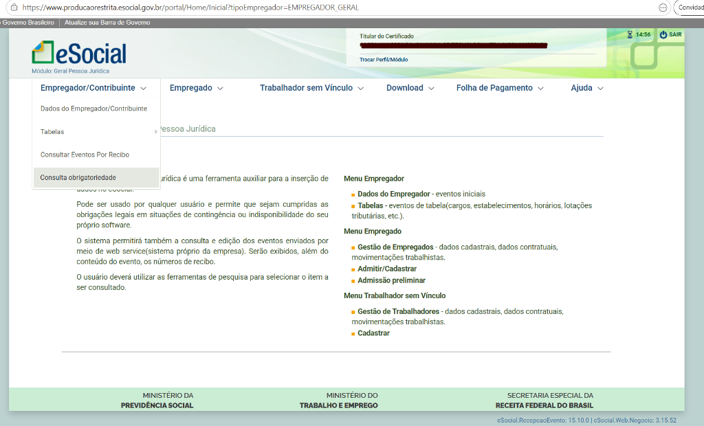
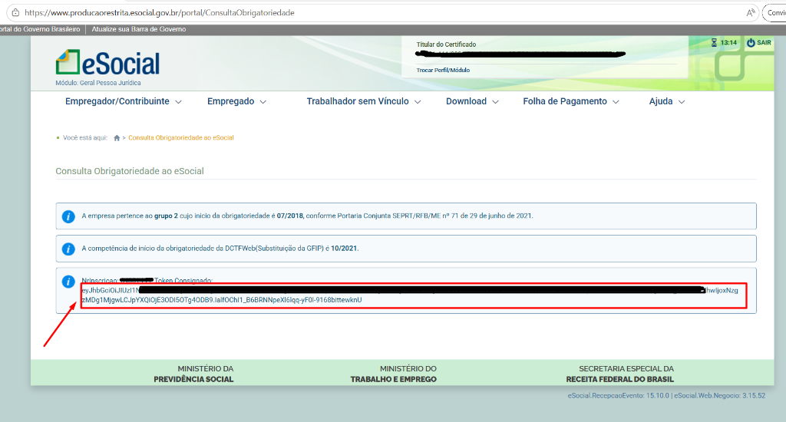

# Como Obter o Token JWT para o eSocial Consignado

Este guia explica passo a passo como obter o token JWT necessário para
utilizar este aplicativo no ambiente de **Produção Restrita** do eSocial.

> **Pré-requisitos:**
>
> - Certificado digital válido (e-CNPJ ou procuração eletrônica)
> - Navegador com o certificado digital instalado

---

## Passo 1 — Acessar o ambiente de Produção Restrita

Abra o navegador e acesse:

🔗 **<https://login.producaorestrita.esocial.gov.br/login.aspx>**

Você verá a página inicial do ambiente de **Produção Restrita (testes)** do
eSocial. Clique no botão **"Clique aqui para acessar o ambiente de testes via
gov.br"**.

---

## Passo 2 — Autenticar com certificado digital

Você será redirecionado para a página de login do **gov.br**. O navegador
exibirá uma janela para **selecionar o certificado digital**.

1. Selecione o certificado da empresa desejada.
2. Clique em **OK**.
3. Se solicitado, insira a senha (PIN) do certificado.

---

## Passo 3 — Navegar até "Consulta obrigatoriedade"

Após o login, você estará no portal do eSocial. Para encontrar o token:

1. No menu superior, clique em **Empregador/Contribuinte**.
2. No submenu que se abre, clique em **Consulta obrigatoriedade**.

---

## Passo 4 — Copiar o token

Na página de **Consulta Obrigatoriedade ao eSocial**, serão exibidas
informações sobre o grupo da empresa e a competência de início. Na parte
inferior, localize a seção **"Token Consignado"**.

1. O token JWT é o texto longo exibido logo abaixo do rótulo **Token
   Consignado** (começa com `eyJhb...`).
2. Selecione **todo** o conteúdo do token.
3. Copie-o (**Ctrl+C**).
4. Cole o token no campo **"JWT Token"** do aplicativo.

---

## Utilizando o token no aplicativo

Após copiar o token:

1. Abra o aplicativo (`http://localhost:3000`).
2. No campo **JWT Token** (visível no topo da interface), cole o token copiado.
3. Preencha o campo **nrInscricaoEmpregador** com o CNPJ da empresa (apenas
   números, 14 dígitos).
4. Utilize as abas **Receber Lote** ou **Consultar Lote** normalmente.

> ⚠️ **Atenção:** O token tem validade limitada. Caso receba erros de
> autenticação (`401`), repita os passos acima para obter um novo token.
>
> 💡 **Dica:** O token **não é salvo** pelo aplicativo — ele existe apenas em
> memória enquanto a aba do navegador estiver aberta. Ao recarregar a página,
> será necessário informá-lo novamente.
